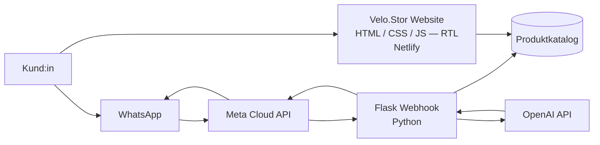

<div align="center">

# Velo.Stor

**Ein arabischsprachiger E-Commerce-Shop mit Rechts-nach-links-Layout (RTL) für Fahrräder, E-Bikes und Scooter — gebaut mit reinem HTML/CSS/JS und angebunden an einen WhatsApp-KI-Assistenten.**

[**🌐 Live-Demo**](https://velo-stor.netlify.app/) · [**🤖 WhatsApp-Bot**](https://github.com/El-Tousy/Meta-API-python-whatsapp-bot) · [**📸 Screenshots**](#screenshots)


[🇬🇧 English](README.md) · [🇩🇪 Deutsch](README.de.md)

</div>

<!-- TODO: 10-20s GIF, das den RTL-Katalog, eine Kategorieseite und eine Produktseite zeigt.
     Aufnahme mit ScreenToGif (Windows) oder Kap (macOS), speichern unter docs/demo.gif -->


---

## Inhaltsverzeichnis

- [Überblick](#überblick)
- [Funktionen](#funktionen)
- [Screenshots](#screenshots)
- [Tech-Stack](#tech-stack)
- [Architektur](#architektur)
- [Erste Schritte](#erste-schritte)
- [Projektstruktur](#projektstruktur)
- [Deployment](#deployment)
- [Technische Herausforderungen und Erkenntnisse](#technische-herausforderungen-und-erkenntnisse)
- [Roadmap](#roadmap)
- [Autorin](#autorin)
- [Lizenz](#lizenz)

---

## Überblick

Velo.Stor ist ein mehrseitiger Online-Shop für Fahrräder, Elektrofahrräder und Scooter, ausgerichtet auf den marokkanischen Markt. Die Oberfläche ist auf Arabisch mit einem Rechts-nach-links-Layout (RTL) gestaltet, während die Produktkategorien ihre französischen Namen behalten — so, wie Fahrradläden in Casablanca sie tatsächlich bezeichnen.

Die Seite ist komplett in reinem HTML, CSS und JavaScript umgesetzt: kein Framework, kein Build-Schritt, keine Abhängigkeiten. Jede Layout-Entscheidung, einschließlich der vollständigen RTL-Richtungslogik, wurde von Hand geschrieben.

Der Shop ist die eine Hälfte eines zweiteiligen Systems. Die andere Hälfte ist ein [WhatsApp-Bot](https://github.com/El-Tousy/Meta-API-python-whatsapp-bot), gebaut mit der Meta Cloud API, der es Kund:innen ermöglicht, denselben Katalog per Konversation statt über eine Webseite zu durchstöbern — naheliegend in einem Markt, in dem WhatsApp der dominierende Kanal für den Handel kleiner Unternehmen ist.

> **Hinweis zum Katalog.** Produkte und Preise sind Beispieldaten, die dazu dienen, das Verhalten des Shops zu demonstrieren. Dies ist ein technisches Projekt, keine echte Verkaufsseite.

---

## Funktionen

### Shop
- **Arabische Oberfläche, RTL-Layout** — Richtung, Ausrichtung, Navigationsreihenfolge und Typografie für rechts-nach-links-Lesefluss konzipiert
- **Zweisprachige Beschriftung** — arabische Oberfläche mit französischen Kategorienamen (Vélo VTT, Vélo Électrique, Trotinette), passend zum lokalen Sprachgebrauch
- **Kategorie-Katalog** — Mountainbikes, E-Bikes und Scooter
- **Produktdetailseiten** — eine Seite pro Modell, mit Spezifikationen und Bildmaterial
- **Responsives Layout** — vom Smartphone bis zum Desktop, handgeschriebene Breakpoints
- **Saubere URLs** — `/products_vtt` statt `/products_vtt.html`, über Netlify-Redirects
- **Informationsseiten** — Über uns, Kontakt, Datenschutzerklärung, AGB

### Admin
- **Konto- und Produktverwaltungsansicht** — Katalogübersicht über eine administrative Oberfläche
- **Kontrollpanel** — <!-- TODO: eine Zeile dazu, was control.html tatsächlich macht -->

### WhatsApp-Integration
- **Konversationelles Durchstöbern** — Kund:innen erkunden den Katalog in einem WhatsApp-Chat
- **Automatisierte Antworten** — Produktinformationen werden ohne menschliches Zutun bereitgestellt
- **Gemeinsamer Katalog** — der Bot antwortet aus demselben Produktbestand, den die Website anzeigt

---

## Screenshots

| Startseite (RTL) | Katalog |
|---|---|
|  |  |

| Produktdetail | Über uns |
|---|---|
|  |  |

| Kontakt |
|---|
|  |

[Alle Screenshots ansehen →](images/screenshots)

---

## Tech-Stack

| Ebene | Technologie | Warum |
|---|---|---|
| Markup | HTML5 | Semantisch, `dir="rtl"` und `lang="ar"` auf Dokumentebene |
| Styling | CSS3 | Handgeschriebenes Stylesheet — volle Kontrolle über RTL-Richtung und Breakpoints |
| Verhalten | Vanilla JavaScript | Navigation und Interaktionen ohne Build-Schritt |
| Hosting | Netlify | Kontinuierliches Deployment von `main`, Clean-URL-Redirects |
| Konversationsebene | Python, Flask, Meta WhatsApp Cloud API | Siehe das [Bot-Repository](https://github.com/El-Tousy/Meta-API-python-whatsapp-bot) |
| Versionierung | Git & GitHub | — |

---

## Architektur



Die Website ist vollständig statisch — jede Seite wird unverändert ausgeliefert, ohne serverseitiges Rendering. Der konversationelle Pfad läuft über einen separaten Flask-Dienst, der Meta-Webhooks empfängt, die Antwort mit OpenAI anreichert und aus demselben Katalog antwortet, den die Website anzeigt.

---

## Erste Schritte

Die Seite ist statisch: nichts zu bauen, keine Abhängigkeiten zu installieren.

### Voraussetzungen

- Ein beliebiger moderner Browser
- Git
- Optional Node.js 18+, um die Seite über HTTP statt über `file://` auszuliefern

### Installation

```bash
git clone https://github.com/El-Tousy/VELO-STOR-Online-Store.git
cd VELO-STOR-Online-Store
```

### Lokal ausführen

```bash
npx serve .
# dann http://localhost:3000 öffnen
```

Es wird empfohlen, die Seite über HTTP auszuliefern, statt `index.html` direkt zu öffnen: relative Pfade und die im Produktivbetrieb genutzten Clean-URL-Routen funktionieren unter dem `file://`-Protokoll nicht.

### Den WhatsApp-Bot verbinden

Der Bot läuft unabhängig in seinem eigenen Repository. Folge der Einrichtung in [Meta-API-python-whatsapp-bot](https://github.com/El-Tousy/Meta-API-python-whatsapp-bot) — der Shop selbst benötigt dafür keine Konfiguration.

---

## Projektstruktur

```
velo-stor/
│
├── index.html                   # Startseite
│
├── pages/
│   ├── products.html            # Vollständiger Katalog
│   ├── products_vtt.html        # Kategorie — Mountainbikes
│   ├── products_electrique.html # Kategorie — E-Bikes
│   ├── products_trotinette.html # Kategorie — Scooter
│   │
│   ├── ciclista.html            # Produkt — Ciclista
│   ├── sport_bike.html          # Produkt — Sport Bike
│   ├── shine_s.html             # Produkt — Shine S
│   ├── tank-m41.html            # Produkt — Tank M41
│   ├── dualtron-togo.html       # Produkt — Dualtron Togo
│   │
│   ├── admin.html               # Admin-Ansicht
│   ├── control.html             # Kontrollpanel
│   │
│   ├── about.html
│   ├── contact.html
│   ├── privacy.html
│   └── terms.html
│
├── assets/
│   ├── css/
│   ├── js/
│   └── images/
│
├── docs/
│   ├── demo.gif
│   └── screenshots/
│
├── netlify.toml                 # Clean-URL-Redirects
├── LICENSE
└── README.md
```

> Dies ist die angestrebte Struktur. Im Repository liegen aktuell noch alle Seiten im Wurzelverzeichnis — siehe [Roadmap](#roadmap).

---

## Deployment

Deployt auf Netlify mit kontinuierlichem Deployment: jeder Push auf `main` veröffentlicht eine neue Version.

| Einstellung | Wert |
|---|---|
| Build-Befehl | *(keiner — statische Seite)* |
| Publish-Verzeichnis | `.` |
| Redirects | `netlify.toml` — entfernt `.html` aus öffentlichen Routen |
| Produktiv-URL | https://velo-stor.netlify.app/ |

---

## Technische Herausforderungen und Erkenntnisse

- **Ein Rechts-nach-links-Layout von Hand bauen.** RTL ist keine gespiegelte Links-nach-rechts-Seite. Ränder, Innenabstände, Flex-Richtung, Icon-Ausrichtung und Scroll-Verhalten müssen alle einzeln neu durchdacht werden. Ohne ein Framework zu arbeiten, das `direction` abstrahiert, hat mir gezeigt, was diese Abstraktionen tatsächlich leisten — und wo sie durchlässig werden.

- **Arabische und lateinische Schrift in einer Oberfläche mischen.** Die Kategorienamen bleiben auf Französisch, weil die Produkte lokal so bekannt sind — dadurch stehen arabischer und lateinischer Text in derselben Zeile. Zeilenhöhe, Ausrichtung und Font-Fallbacks so hinzubekommen, dass sie bewusst statt zufällig wirken, hat mehr Iterationen gebraucht als jeder andere Teil des CSS.

- **Konsistenz über eine mehrseitige statische Seite hinweg.** Ohne Templating-Engine sind Header und Footer in jeder Datei dupliziert und werden von Hand synchron gehalten. Das ist das klarste Argument für komponentenbasierte Frameworks, das mir begegnet ist — nicht aus einem Tutorial, sondern aus der eigenen Pflege dieser Duplikate.

- **Ein Katalog ohne Datenbank.** Produkte sind Seiten, keine Datensätze: ein Produkt hinzuzufügen bedeutet, eine Datei zu erstellen. In dieser Größenordnung funktioniert das, darüber hinaus nicht mehr. Die nächste Iteration verlagert den Katalog in eine JSON-Datei, die von JavaScript konsumiert wird.

- **Ein Katalog, zwei Frontends.** Website und WhatsApp-Bot müssen dieselben Produkte beschreiben. Sie synchron zu halten hat gezeigt, warum eine einzige Quelle der Wahrheit wichtiger ist als jede der beiden Oberflächen für sich.

---

## Roadmap

- [x] RTL-arabischer Shop mit Kategorie- und Produktseiten
- [x] Netlify-Deployment mit Clean URLs
- [x] WhatsApp-Bot-Integration
- [ ] Katalog in eine einzige `products.json` verlagern, die von JavaScript konsumiert wird
- [ ] Repository in `pages/` und `assets/` reorganisieren
- [ ] Optionaler Französisch/Arabisch-Sprachumschalter
- [ ] Warenkorb mit `localStorage`
- [ ] Clientseitige Suche und Filterung
- [ ] Barrierefreiheits-Check — Alt-Texte, Tastaturnavigation, Kontrast
- [ ] Lighthouse-Audit und Performance-Budget

---

## Autorin

**Leila El-Tousy** — Informatikstudentin, Marokko

[](https://github.com/El-Tousy)
[](mailto:leilaeltousy@gmail.com)

**Verwandtes Projekt:** [WhatsApp-KI-Bot](https://github.com/El-Tousy/Meta-API-python-whatsapp-bot) — das konversationelle Frontend zu diesem Shop.

---

## Lizenz

Veröffentlicht unter der MIT-Lizenz. Details siehe [LICENSE](LICENSE).

---

<div align="center">

⭐ Wenn dir dieses Projekt hilft, freue ich mich über einen Stern.

</div>
