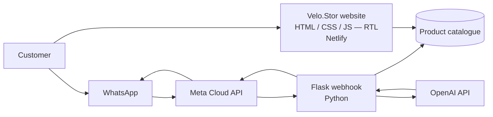

<div align="center">

# Velo.Stor

**An Arabic-first, right-to-left e-commerce storefront for bikes, e-bikes and scooters — built in vanilla HTML/CSS/JS and connected to a WhatsApp AI assistant.**

[**🌐 Live Demo**](https://velo-stor.netlify.app/) · [**🤖 WhatsApp Bot**](https://github.com/El-Tousy/Meta-API-python-whatsapp-bot) · [**📸 Screenshots**](#screenshots)


[🇬🇧 English](README.md) · [🇩🇪 Deutsch](README.de.md)

</div>

<!-- TODO: 10-20s GIF showing the RTL catalogue, a category page and a product page.
     Record with ScreenToGif (Windows) or Kap (macOS), save as docs/demo.gif -->


---

## Table of Contents

- [Overview](#overview)
- [Features](#features)
- [Screenshots](#screenshots)
- [Tech Stack](#tech-stack)
- [Architecture](#architecture)
- [Getting Started](#getting-started)
- [Project Structure](#project-structure)
- [Deployment](#deployment)
- [Technical Challenges and Learnings](#technical-challenges-and-learnings)
- [Roadmap](#roadmap)
- [Author](#author)
- [License](#license)

---

## Overview

Velo.Stor is a multi-page online store for bicycles, electric bikes and scooters, aimed at the Moroccan market. The interface is in Arabic with a right-to-left layout, while product categories keep their French names — the way bike shops in Casablanca actually label them.

It is built entirely in vanilla HTML, CSS and JavaScript: no framework, no build step, no dependencies. Every layout decision, including the full RTL direction handling, is written by hand.

The storefront is one half of a two-part system. The other half is a [WhatsApp bot](https://github.com/El-Tousy/Meta-API-python-whatsapp-bot) built with the Meta Cloud API, which lets a customer browse the same catalogue through a conversation instead of a web page — a natural fit in a market where WhatsApp is the dominant channel for small-business commerce.

> **Note on the catalogue.** Products and prices are sample data used to exercise the store's behaviour. This is a technical project, not a live commercial site.

---

## Features

### Storefront
- **Arabic interface, RTL layout** — direction, alignment, navigation order and typography built for right-to-left reading
- **Bilingual labelling** — Arabic UI with French category names (Vélo VTT, Vélo Électrique, Trotinette), matching local usage
- **Category catalogue** — mountain bikes, electric bikes and scooters
- **Product detail pages** — one page per model, with specifications and imagery
- **Responsive layout** — mobile through desktop, hand-written breakpoints
- **Clean URLs** — `/products_vtt` rather than `/products_vtt.html`, via Netlify redirects
- **Informational pages** — About, Contact, Privacy Policy, Terms

### Admin
- **Account and product management view** — catalogue overview from an administrative interface
- **Control panel** — <!-- TODO: one line on what control.html actually does -->

### WhatsApp integration
- **Conversational browsing** — customers explore the catalogue in a WhatsApp thread
- **Automated replies** — product information served without human intervention
- **Shared catalogue** — the bot answers from the same product set the site displays

---

## Screenshots

| Homepage (RTL) | Catalogue |
|---|---|
|  |  |

| Product detail | About |
|---|---|
|  |  |

| Contact |
|---|
|  |

[View all screenshots →](images/screenshots)

---

## Tech Stack

| Layer | Technology | Why |
|---|---|---|
| Markup | HTML5 | Semantic, `dir="rtl"` and `lang="ar"` at the document root |
| Styling | CSS3 | Hand-written stylesheet — full control over RTL direction and breakpoints |
| Behaviour | Vanilla JavaScript | Navigation and interactions with no build step |
| Hosting | Netlify | Continuous deployment from `main`, clean-URL redirects |
| Conversational layer | Python, Flask, Meta WhatsApp Cloud API | See the [bot repository](https://github.com/El-Tousy/Meta-API-python-whatsapp-bot) |
| Versioning | Git & GitHub | — |

---

## Architecture



The website is fully static — every page is served as-is, with no server-side rendering. The conversational path runs through a separate Flask service that receives Meta webhooks, enriches the reply with OpenAI, and answers from the same catalogue the site displays.

---

## Getting Started

The site is static: nothing to build, no dependencies to install.

### Prerequisites

- Any modern browser
- Git
- Optionally, Node.js 18+ to serve the site over HTTP rather than `file://`

### Installation

```bash
git clone https://github.com/El-Tousy/VELO-STOR-Online-Store.git
cd VELO-STOR-Online-Store
```

### Running locally

```bash
npx serve .
# then open http://localhost:3000
```

Serving over HTTP is recommended rather than opening `index.html` directly: relative paths, and the clean-URL routes used in production, do not resolve under the `file://` protocol.

### Connecting the WhatsApp bot

The bot runs independently in its own repository. Follow the setup in [Meta-API-python-whatsapp-bot](https://github.com/El-Tousy/Meta-API-python-whatsapp-bot) — the storefront needs no configuration on its side.

---

## Project Structure

```
velo-stor/
│
├── index.html                   # Homepage
│
├── pages/
│   ├── products.html            # Full catalogue
│   ├── products_vtt.html        # Category — mountain bikes
│   ├── products_electrique.html # Category — electric bikes
│   ├── products_trotinette.html # Category — scooters
│   │
│   ├── ciclista.html            # Product — Ciclista
│   ├── sport_bike.html          # Product — Sport Bike
│   ├── shine_s.html             # Product — Shine S
│   ├── tank-m41.html            # Product — Tank M41
│   ├── dualtron-togo.html       # Product — Dualtron Togo
│   │
│   ├── admin.html               # Admin view
│   ├── control.html             # Control panel
│   │
│   ├── about.html
│   ├── contact.html
│   ├── privacy.html
│   └── terms.html
│
├── assets/
│   ├── css/
│   ├── js/
│   └── images/
│
├── docs/
│   ├── demo.gif
│   └── screenshots/
│
├── netlify.toml                 # Clean-URL redirects
├── LICENSE
└── README.md
```

> This is the target structure. The repository currently keeps every page at the root — see [Roadmap](#roadmap).

---

## Deployment

Deployed on Netlify with continuous deployment: every push to `main` publishes a new version.

| Setting | Value |
|---|---|
| Build command | *(none — static site)* |
| Publish directory | `.` |
| Redirects | `netlify.toml` — strips `.html` from public routes |
| Production URL | https://velo-stor.netlify.app/ |

---

## Technical Challenges and Learnings

- **Building a right-to-left layout by hand.** RTL is not a mirrored left-to-right page. Margins, padding, flex direction, icon orientation and scroll behaviour all have to be reconsidered individually. Working without a framework that abstracts `direction` away taught me what those abstractions are actually doing, and where they leak.

- **Mixing Arabic and Latin scripts in one interface.** Category names stay in French because that is how the products are known locally, which means Arabic and Latin text share the same line. Getting line height, alignment and font fallbacks to look deliberate rather than accidental took more iteration than any other part of the CSS.

- **Consistency across a multi-page static site.** With no templating engine, the header and footer are duplicated in every file and kept in sync by hand. This is the clearest argument for component-based frameworks I have encountered — not from a tutorial, but from maintaining the duplication myself.

- **A catalogue without a database.** Products are pages, not records: adding a product means creating a file. Workable at this size, unworkable beyond it. The next iteration moves the catalogue into a JSON file consumed by JavaScript.

- **One catalogue, two front-ends.** The site and the WhatsApp bot must describe the same products. Keeping them aligned showed why a single source of truth matters more than either interface on its own.

---

## Roadmap

- [x] RTL Arabic storefront with category and product pages
- [x] Netlify deployment with clean URLs
- [x] WhatsApp bot integration
- [ ] Move the catalogue into a single `products.json` consumed by JavaScript
- [ ] Reorganise the repository into `pages/` and `assets/`
- [ ] Optional French / Arabic language switch
- [ ] Shopping cart with `localStorage`
- [ ] Client-side search and filtering
- [ ] Accessibility pass — alt text, keyboard navigation, contrast
- [ ] Lighthouse audit and performance budget

---

## Author

**Leila El-Tousy** — Computer Science student, Morocco

[](https://github.com/El-Tousy)
[](mailto:leilaeltousy@gmail.com)

**Related project:** [WhatsApp AI Bot](https://github.com/El-Tousy/Meta-API-python-whatsapp-bot) — the conversational front-end for this store.

---

## License

Released under the MIT License. See [LICENSE](LICENSE) for details.

---

<div align="center">

⭐ If this project is useful to you, consider leaving a star.

</div>
